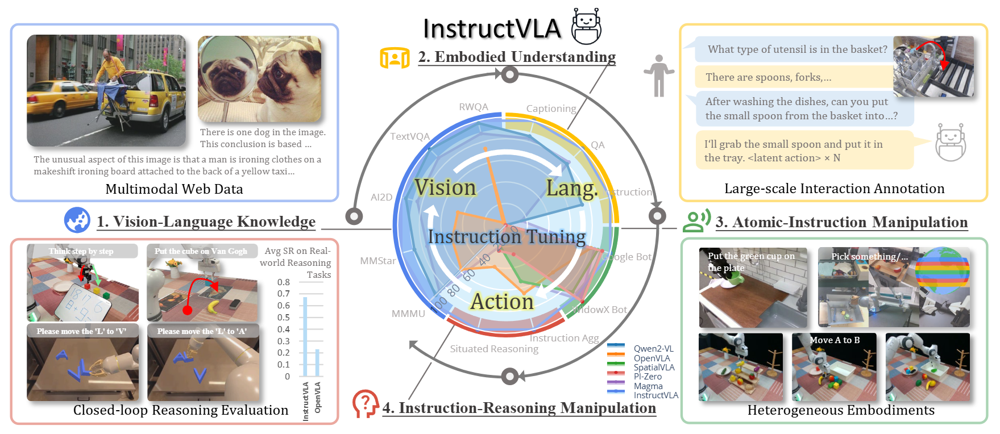

<br>
<p align="center">
  <h1 align="center"><strong>InstructVLA:<br>Vision-Language-Action Instruction Tuning<br>from Understanding to Manipulation</strong></h1>
  <p align="center">
    <a href='https://scholar.google.com/citations?user=l5HWdWEAAAAJ&hl=en' target='_blank'>Shuai Yang*</a>, <a href='' target='_blank'>Hao Li*</a>, <a href='' target='_blank'>Bin Wang</a>,  <a href='https://yilunchen.com/about/' target='_blank'>Yilun Chen</a>, <a href='' target='_blank'>Yang Tian</a>, <a href='https://tai-wang.github.io/' target='_blank'>Tai Wang</a>, <br><a href='https://hanqingwangai.github.io/' target='_blank'>Hanqing Wang</a>, <a href='https://scholar.google.co.uk/citations?user=r6CvuOUAAAAJ&hl=en' target='_blank'>Feng Zhao</a>, <a href='' target='_blank'>Yiyi Liao</a>, <a href='https://oceanpang.github.io/' target='_blank'>Jiangmiao Pang</a>
    <br>
    * Equal Contributions
    <br>
    University of Science and Technology of China, Zhejiang University, <br> Shanghai Artificial Intelligence Laboratory
    <br>
  </p>

<!-- <p align="center"><strong>Under Review</strong></p> -->

</p>


<p align="center">
  <a href="http://arxiv.org/abs/2507.17520/">
    
  </a>
  <a href="https://yangs03.github.io/InstructVLA_Home/">
    
  </a>
  <a href="https://huggingface.co/datasets/ShuaiYang03/VLA_Instruction_Tuning">
    
  </a>
  <a href="https://github.com/YangS03/my_maniskill/tree/main/scripts">
    
  </a>
</p>

<p align="center">
  <h5 align="center"><strong>25/9/15: We are updating the code. For any issues, please pull the latest version before reporting bugs. </strong></h5>
</p>


<!-- ## 📋 Contents

- [🔥 Highlight](#highlight)
- [🛠️ Getting Started](#getting_started)
- [📌 TODO](#todo)
- [🔗 Citation](#citation)
- [📄 License](#license)
- [👏 Acknowledgements](#acknowledgements) -->

## 🔥 Overview <a name="overview"></a>

1. We propose **InstructVLA**, a VLA architecture and training pipeline that emphasizes the importance of language capability in VLAs by efficiently preserving pretrained vision-language knowledge from VLMs while integrating manipulation as a component of instruction following.
2. We design **a practical data and evaluation pipeline for vision-language-action instruction following**, supported by 650K tailored VLA-IT annotations and a manually curated benchmark suite, enabling evaluation of VLAs' instruction generalization capabilities.
3. InstructVLA achieves leading performance across robotic manipulation tasks, multimodal benchmarks, and real-world deployments, enabling intuitive and controllable human-robot interaction.



## 🛠️ Getting Started <a name="getting_started"></a>

### Download Data and Assets

#### 1. Vision-Language-Action Instruction Tuning Dataset

1. Download the dataset from [VLA\_Instruction\_Tuning](https://huggingface.co/datasets/ShuaiYang03/VLA_Instruction_Tuning).
2. Move `VLA_Instruction_Tuning/annotation/bridge_instruction.json` and `VLA_Instruction_Tuning/annotation/fractal_instruction.json` to `data_pipeline/data/`.
3. Move `VLA_Instruction_Tuning/bridge_dataset` and `VLA_Instruction_Tuning/fractal20220817_data` to the directory where you store the OXE datasets.

   * Note: We modified the fractal dataset by adding episode IDs and file IDs aligned with the bridge dataset to facilitate indexing.
   * Ensure that `--run_root_dir` points to the directory containing your OXE datasets.
4. A usage example is provided in `data_pipeline/data_loading_example.ipynb`, which previews the dataset.

#### 2. General Multimodal Dataset

We use the [Bunny](https://huggingface.co/datasets/BoyaWu10/Bunny-v1_1-data/tree/main/finetune) dataset as the multimodal source for VLA-IT training.

* Download the dataset to the project root and rename the folder as `bunny_dataset`.
* Use the 2M mixture file: `bunny_llava_allava_2m.json`.

#### 3. VLA-IT Validation Set

Please follow the `mm_evaluation/README.md`.

#### 4. Pretrained Weights

1. Download the VLM and Empty LoRA adapter from [InstructVLA\_Assets](https://huggingface.co/ShuaiYang03/InstructVLA_Assets) and place them in `ckpt/`.
2. Download additional pretrained checkpoints from [InstructVLA-collection](https://huggingface.co/collections/ShuaiYang03/instructvla-68c2434c3615cf1597894e86).

  | Category               | Checkpoint Name                                              | Description                                  | Notes / Recommendation                                      |
  | ---------------------- | ------------------------------------------------------------ | -------------------------------------------- | ----------------------------------------------------------- |
  | **LIBERO Pretraining** | [instructvla_pretraining_v2_libero_goal_wrist-image_aug · Hugging Face](https://huggingface.co/ShuaiYang03/instructvla_pretraining_v2_libero_goal_wrist-image_aug) | Pretrained LIBERO checkpoints.               | Eval with Ensemble & wrist view                             |
  |  | [instructvla_pretraining_v2_libero_10_wrist-image_aug · Hugging Face](https://huggingface.co/ShuaiYang03/instructvla_pretraining_v2_libero_10_wrist-image_aug) | Pretrained LIBERO checkpoints.               | Eval with Ensemble & wrist view                                          |
  |  | [instructvla_pretraining_v2_libero_object_wrist-image_aug · Hugging Face](https://huggingface.co/ShuaiYang03/instructvla_pretraining_v2_libero_object_wrist-image_aug) | Pretrained LIBERO checkpoints.               | Eval with Ensemble & wrist view                                          |
  |  | [instructvla_pretraining_v2_libero_spatial_wrist-image_aug · Hugging Face](https://huggingface.co/ShuaiYang03/instructvla_pretraining_v2_libero_spatial_wrist-image_aug) | Pretrained LIBERO checkpoints.               | Eval with Ensemble & wrist view                                          |
  | **Expert-Simpler**     | [instructvla_pretraining_v2_query_64_lora_state · Hugging Face](https://huggingface.co/ShuaiYang03/instructvla_pretraining_v2_query_64_lora_state) | InstructVLA-Expert with robot states.        | Eval with robot state. Performs stronger on **SimplerEnv**. |
  |                        | [instructvla_pretraining_v2_query_64_lora · Hugging Face](https://huggingface.co/ShuaiYang03/instructvla_pretraining_v2_query_64_lora) | InstructVLA-Expert without robot states.     | –                                                           |
  | **Generalist-Simpler** | [instructvla_finetune_v2_xlora_freeze_head_instruction_state · Hugging Face](https://huggingface.co/ShuaiYang03/instructvla_finetune_v2_xlora_freeze_head_instruction_state) | InstructVLA-Generalist with robot states.    | –                                                           |
  |                        | [instructvla_finetune_v2_xlora_freeze_head_instruction · Hugging Face](https://huggingface.co/ShuaiYang03/instructvla_finetune_v2_xlora_freeze_head_instruction) | InstructVLA-Generalist without robot states. | Generalizes better on **SimplerEnv-Instruct**.              |

  > Some of the checkpoints are being cleaned and will be released soon.

   **Recommendation:**

   * InstructVLA-Expert *with* states shows stronger performance on SimplerEnv.
   * InstructVLA-Generalist *without* states generalizes better on SimplerEnv-Instruct.

#### Conda Environment

```bash
# Create and activate virtual environment (conda or venv)
conda create -n instructvla python=3.10 -y
conda activate instructvla
# Install PyTorch (with CUDA 12.1 support)
pip install torch==2.2.0 torchvision==0.17.0 torchaudio==2.2.0 --index-url https://download.pytorch.org/whl/cu121
# HuggingFace ecosystem
pip install transformers==4.51.0 accelerate==1.3.0 peft==0.13.0

pip install numpy==1.26.4

# Install Flash Attention 2 for training (https://github.com/Dao-AILab/flash-attention)
#   =>> If you run into difficulty, try `pip cache remove flash_attn` first
pip install packaging ninja
ninja --version; echo $?  # Verify Ninja --> should return exit code "0"
pip install flash-attn==2.5.5 --no-build-isolation
# or pip install https://github.com/Dao-AILab/flash-attention/releases/download/v2.5.5/flash_attn-2.5.5+cu122torch2.2cxx11abiFALSE-cp310-cp310-linux_x86_64.whl
pip install -r pip_requirements.txt
```

For SimplerEnv, additional vulkan libraries are required:

```bash
# Install Vulkan runtime libraries and tools
conda install conda-forge::libvulkan-loader
```

#### Benchmark Installation

**1. LIBERO**: 

Clone and install the LIBERO repo:

```bash
git clone https://github.com/Lifelong-Robot-Learning/LIBERO.git libero
cd libero
pip install -e .
```

Additionally, install other required packages:

```bash
cd deploy/libero
pip install -r experiments/robot/libero/libero_requirements.txt
```

**2. SimplerEnv and SimplerEnv-Instruct**: Clone the modified [ManiSkill2\_real2sim](https://github.com/YangS03/my_maniskill) under `InstructVLA/SimplerEnv`, then rename it to `ManiSkill2_real2sim`. Install both projects following their respective `README.md` files.

```bash

rm SimplerEnv/ManiSkill2_real2sim

cd SimplerEnv

# install Maniskill
git clone https://github.com/YangS03/my_maniskill.git ManiSkill2_real2sim
cd ManiSkill2_real2sim
pip install -e .

# install SimplerEnv
cd ..
pip install -e .
```

**3. vlmeval**: Please follow `mm_evaluation/vlmeval/README.md`.

### Project Structure

* **`prismatic`**: Dataloader from OpenVLA, along with utility tools such as `overwatch`.

  * The VLA-IT dataset is loaded in `/prismatic/vla/datasets/rlds/dataset.py`.
  * We customize `RLDSBatchTransform` and `PaddedCollatorForActionPrediction` in each version of the InstructVLA models under the `vla/` folder, since different variants use different input information.
  * In `prismatic/vla/datasets/rlds/oxe/materialize.py` (L9), an alternative data path is provided. We recommend first setting the main data root directory using `--data_root_dir` for data stored on Ceph or other cloud devices, and specifying data that cannot be accessed from Ceph in `LOCAL_OXE` within `materialize.py`.
  * In `prismatic/vla/datasets/rlds/dataset.py`(L247), although RLDS provides `_traj_index` and `_frame_index`, we found that they are neither unique nor fixed during training. Therefore, do not use them as an index or hash key!

* **`vla`**: Model implementations.

  * `film_vit.py`: Adapted from OpenVLA-OFT with modifications.
  * `action_head.py`: Contains two action head configurations (with/without robot state).
  * `eagle_utils.py`: Formats the prompts.
  * `modeling_eagle_chat.py`: Backup of `ckpt/Eagle2-2B/modeling_eagle_chat.py`; not used.
  * `instructvla_eagle_dual_sys_v2_meta_query_v2.py`: Basic InstructVLA model with a single third-view input.
  * `instructvla_eagle_dual_sys_v2_meta_query_v2_state.py`: InstructVLA variant using both third-view input and robot state (for SimplerEnv and SimplerEnv-Instruct).
  * `instructvla_eagle_dual_sys_v2_meta_query_v2_libero_wrist.py`: InstructVLA variant using both third-view and wrist-view inputs (for LIBERO).

* **`scripts`**: Training scripts.

  * `train_eagle_dual_v2_action_only_meta_query_v2.py`: Pretraining and fine-tuning script for InstructVLA on SimplerEnv.
  * `train_eagle_dual_v2_action_only_meta_query_v2_libero_wrist.py`: Training script for InstructVLA on LIBERO.

  **Note:** The main difference between the two training scripts is the imported VLA model variant.

* **`data_pipeline`**: Data annoation pipeline.

  * `data_loading_example.ipynb`: Script demonstrates how to load an episode and corresponding VLA-IT annotation.

* **`mm_evaluation`**: Multimodal evaluation scrips.

### Evaluation

**1. Minimal Chat Example**

```python
import torch
from vla.instructvla_eagle_dual_sys_v2_meta_query_v2 import load, load_vla
from PIL import Image
import numpy as np

model_path = 'outputs/release_ckpts/instructvla_finetune_v2_xlora_freeze_head_instruction--image_aug/checkpoints/step-013500-epoch-01-loss=0.1093.pt'

# Load Stage-2 (Generalist) model
model = load_vla(model_path, stage="stage2").eval().to(torch.bfloat16).cuda()

messages = [
    {"content": "You are a helpful assistant."},  # system
    {
        "role": "user",
        "content": "Can you describe the main idea of this image?",
        "image": [{'np_array': np.asarray(Image.open("./asset/teaser.png"))}]
    }
]

# Preprocess input
inputs = model.processor.prepare_input(dict(prompt=messages))
autocast_dtype = torch.bfloat16

with torch.autocast("cuda", dtype=autocast_dtype, enabled=True):
    output = model.vlm.generate(
        input_ids=inputs['input_ids'].cuda(),
        attention_mask=inputs['attention_mask'].cuda(),
        pixel_values=inputs['pixel_values'].cuda(),
        max_new_tokens=200,
        output_hidden_states=False,
    )

response = model.processor.tokenizer.decode(output[0])
print(response)
```

**Example Output:**

```
The image is a diagram that illustrates the process of "InstructVLA," which stands for Instruction Tuning for Visual Language Understanding. It is divided into four main sections: 1) Vision-Language Knowledge, 2) Embedded Understanding, 3) Atomic-Instruction Manipulation, and 4) Instruction-Reasoning Manipulation. Each section contains a series of images and text that describe the steps involved in the process. The diagram uses a circular flow to show the progression from understanding visual and language data to manipulating instructions.<|im_end|>
```


**Notice:** Due to the hook issue of [Peft: X-LoRA](https://github.com/huggingface/peft/issues/1472#issuecomment-3235817807), a manual hook removal function has been added at `vla.eagle_utils` (L1283–1284). If you do not use the customized model forward, you may experience a noticeable slowdown during language generation.


**2. LIBERO**

We provide four evaluation scripts in `scripts_test_SimplerEnv`. They are mostly similar. The default evaluation is configured for an 8-GPU node, and the script will distribute the evaluation evenly across GPUs. The argument `--task_suite_name` should be chosen from {`libero_spatial`, `libero_object`, `libero_goal`, `libero_10`}. The flag `--use_length` specifies how many steps of the predicted action chunk will be executed, where `-1` denotes using  action ensemble mode. 

We present the success rate and standard error for each method across four task suites, averaged over three random seeds with 500 trials. “KI” denotes *knowledge insulating* from \[Driess et al., 2025].

| Method                                    | Spatial    | Object     | Goal           | 10 (Long)  | Average    |
| ----------------------------------------- | ---------- | ---------- | -------------- | ---------- | ---------- |
| OpenVLA-7B       | 84.7 ± 0.9 | 88.4 ± 0.8 | 79.2 ± 1.0     | 53.7 ± 1.3 | 76.5 ± 0.6 |
| OpenVLA-OFT-7B   | 97.6 ± 0.9 | 98.4 ± 0.8 | 97.9 ± 1.0     | 94.5 ± 1.3 | 97.1 ± 0.6 |
| SpatialVLA-2B    | 88.2 ± 0.5 | 89.9 ± 0.7 | 78.6 ± 0.6     | 55.5 ± 1.0 | 78.1 ± 0.7 |
| π₀-2B            | 96.8 ± 0.8 | 98.8 ± 0.9 | 95.8 ± 1.1     | 85.2 ± 1.2 | 94.2 ± 0.9 |
| π₀-FAST-2B       | 96.4 ± 0.7 | 96.8 ± 0.7 | 88.6 ± 1.0     | 60.2 ± 1.4 | 85.5 ± 1.0 |
| GR00T-N1-1.34B   | 94.4 ± 0.9 | 97.6 ± 1.0 | 93.0 ± 1.2     | 90.6 ± 1.0 | 93.9 ± 1.1 |
| π₀.₅ + KI (from scratch)   | 96.6       | 97.2       | 94.6           | 84.8       | 93.3       |
| π₀.₅ + KI (from generalist model) | 98.0       | 97.8       | 95.6           | 85.8       | 94.3       |
| InstructVLA (w/o wrist view)              | 92.4       | 95.6       | 92.0           | 76.6       | 89.2       |
| InstructVLA-1.5B                          | 97.3 ± 0.5 | 99.6 ± 0.0 | 96.5 ± 0.5     | 89.8 ± 1.6 | 95.8 ± 0.4 |


**Notice:** 
1. The way the action chunk is executed greatly affects performance. The LIBERO checkpoints we provided on Hugging Face use the ensemble mode (--use_length -1). However, the best checkpoint under ensemble execution is not necessarily the best when executing all actions sequentially.

2. Following OpenVLA and OpenVLA-OFT, the four tasks are trained and evaluated independently. For each checkpoint, we provide three evaluation results, obtained with three different random seeds, in the `eval` folder.

```bash
#!/bin/bash

CKPT_LIST=(
  "path/to/checkpoint_1.pt"
  "path/to/checkpoint_2.pt"
  "..."
)

# Loop over the checkpoint list and GPUs
for i in "${!CKPT_LIST[@]}"; do
  GPU_ID=$((i % 8))  # Cycle through GPUs 0-7
  CHECKPOINT="${CKPT_LIST[$i]}"
  
  # Run the evaluation script for each checkpoint and GPU
  CUDA_VISIBLE_DEVICES=$GPU_ID python deploy/libero/run_libero_eval.py \
    --model_family instruct_vla \
    --pretrained_checkpoint "$CHECKPOINT" \
    --task_suite_name libero_goal \
    --local_log_dir Libero/release_ensemble \
    --use_length -1 \
    --center_crop True &

  # --use_length == -1 : execute the ensembled action
  # --use_length >= 1  : execute action_chunk[0:use_length]
  
  sleep 5
done

# Wait for all background jobs to finish
wait
```

**3. SimplerEnv**

We provide two evaluation scripts in `scripts_test_SimplerEnv`. In the original version of SimplerEnv, the model is reloaded between different evaluation tasks. To speed up evaluation, we repack the model as an independent server so that checkpoints are reloaded only once for each task (four main tasks on Google Robot and three main tasks on Bridge).

From our practice, a node with **8×A100 GPUs**, **128 CPU cores**, and **>500 GB RAM** can run **two evaluations simultaneously**.

### Running Two Evaluations

To run two evaluations in parallel, update the checkpoint paths in:

```
scripts_test_SimplerEnv/simpler_0.sh
scripts_test_SimplerEnv/simpler_1.sh
```

Then run:

```
scripts_test_SimplerEnv/evaluate_two_checkpoints.sh
```

### Running a Single Evaluation

To run a single evaluation, update the checkpoint path in:

```
scripts_test_SimplerEnv/simpler_A.sh
```

Then run:

```
scripts_test_SimplerEnv/evaluate_single_checkpoint.sh
```

### Killing Evaluations

Since the server is launched in the background, a simple `CTRL+C` cannot terminate the process. To kill the evaluations, run:

```
scripts_test_SimplerEnv/kill_unfinished.sh
```

**Notice:** This script will terminate *all* evaluations on the node.


**4. SimplerEnv-Instruct**

To run a single evaluation, update the checkpoint path in:

```
scripts_test_SimplerEnv/eval_instruct_vla_1.sh
```

To control whether language reasoning is enabled, modify the `use_generate` flag in the `predict_action` function of each `vla.py`.

**Notice:** Keep the `use_generate` setting fixed throughout the entire evaluation. After completion, a file named `final_results_instruct.log` will be generated in the log directory corresponding to your checkpoint (`xxx.pt/log`). In this log, `Free` denotes *instruction aggregation*, while `Alt` denotes *situated reasoning*. You can use `scripts_test_SimplerEnv/kill_unfinished.sh` to terminate evaluation.


**5. Multimodal**

Please ensure you have OpenAI API for benchmarks requiring GPT evaluation

```bash
cd mm_evaluation/vlmeval

export OPENAI_API_BASE=TBD
export OPENAI_API_KEY=sk-TBD

export MASTER_PORT=$((RANDOM % 101 + 20000))
torchrun --nproc-per-node=8 --master_port $MASTER_PORT run.py \
         --data MMBench_DEV_EN_V11 OCRBench MMMU_DEV_VAL MMStar ChartQA_TEST DocVQA_VAL HallusionBench ScienceQA_TEST TextVQA_VAL AI2D_TEST InfoVQA_VAL RealWorldQA MMVet MME \
         --model InstructVLA \
         --work-dir path/to/InstructVLA/outputs/vlmeval/InstructVLA \
         --tag results \
         --model_path path/to/model.pt \
         --reuse \
         --verbose
```


**Notice:** For errors such as `FileNotFoundError: [Errno 2] No such file or directory: '.../08_MME.pkl'`, please rerun the evaluation script. It will automatically resume the evaluation until the correct results are obtained.


**6. Embodied Multimodal(on VLA-IT validation set)**

**1.** Inference Results

```bash
python -m mm_evaluation.VLA_IT_InstructVLA \
  --model_path outputs/release_ckpts/instructvla_finetune_v2_xlora_freeze_head_instruction--image_aug/checkpoints/step-013500-epoch-01-loss=0.1093.pt \
  --work_dir outputs/release_ckpts/instructvla_finetune_v2_xlora_freeze_head_instruction--image_aug/vlmeval \
  --task all
```

**2.** Get Score

Because we need to assess the learning-based metrics, a GPU is required. `--eval_bs` denotes the batch size used to calculate the embedding; please set it depending on your VRAM.

```bash
python mm_evaluation/Evaluator.py \
  --directory_path outputs/release_ckpts/instructvla_finetune_v2_xlora_freeze_head_instruction--image_aug/vlmeval/cap.json \
  --eval_bs 500
```

### Train

1.  Stage-1 (Expert)

**Single-node pretraining**

```bash
#!/bin/bash
export GPUS_PER_NODE=8
export MASTER_ADDR=$(scontrol show hostnames $SLURM_JOB_NODELIST | head -n 1)
export MASTER_PORT=29323

# Fix for: libcudnn_ops_infer.so.8 link-time reference symbol error
export LD_LIBRARY_PATH=~/miniconda3/envs/openvla/lib/python3.10/site-packages/nvidia/cudnn/lib:$LD_LIBRARY_PATH
export LD_PRELOAD=~/miniconda3/envs/openvla/lib/python3.10/site-packages/nvidia/cudnn/lib/libcudnn_ops_infer.so.8

python -m torch.distributed.run \
  --nproc_per_node 8 --nnodes 1 --node_rank 0 \
  --master_port $MASTER_PORT \
  scripts/train_eagle_dual_v2_action_only_meta_query_v2.py \
    --vla.base_vlm "ckpt/Eagle2-2B" \
    --vla.type prism-qwen25-dinosiglip-224px+0_5b \
    --vla.data_mix bridge_rt_1 \
    --vla.expected_world_size 8 \
    --vla.global_batch_size 128 \
    --vla.per_device_batch_size 16 \
    --vla.train_strategy 'fsdp-full-shard' \
    --vla.learning_rate 5e-5 \
    --data_root_dir "path/to/your/oxe" \
    --run_root_dir ./outputs/pretraining \
    --run_id InstructVLA_pretraining_v2_query_64_mlp_lora_single_node_bs128 \
    --image_aug True \
    --wandb_project "TBD" \
    --wandb_entity "TBD" \
    --save_interval 5000 \
    --future_action_window_size 15 \
    --past_action_window_size 0 \
    --is_resume False \
    --stage stage1 \
    --with_pointing False \
    --use_mm False
```
> For LIBERO, we recommend setting `future_action_window_size=7`, which corresponds to a chunk size of 8 with `--global_batch_size=256`.
> For SimplerEnv, we recommend setting `future_action_window_size=15`, which corresponds to a chunk size of 16 with `--global_batch_size=128`.
---

**Multi-node pretraining (SLURM)**

```bash
#!/bin/bash
#SBATCH --job-name=VLA
#SBATCH -p efm_t
#SBATCH -N 8                         # number of nodes
#SBATCH --ntasks-per-node=1          # crucial: 1 task per dist per node
#SBATCH --cpus-per-task=128          # number of cores per task
#SBATCH --gres=gpu:8                 # GPUs per node
#SBATCH --output=trash/%x-%j.out
#SBATCH -e trash/%x-%j.err

export GPUS_PER_NODE=8
export MASTER_ADDR=$(scontrol show hostnames $SLURM_JOB_NODELIST | head -n 1)
export MASTER_PORT=$((RANDOM % 101 + 20000))

# NCCL configuration (must be set correctly on your cluster)
export NCCL_SOCKET_IFNAME=TBD
export NCCL_IB_HCA=TBD
export NCCL_TIMEOUT=3600  # longer timeout for stable training

# Fix for: libcudnn_ops_infer.so.8 link-time reference symbol error
export LD_LIBRARY_PATH=~/miniconda3/envs/openvla/lib/python3.10/site-packages/nvidia/cudnn/lib:$LD_LIBRARY_PATH
export LD_PRELOAD=~/miniconda3/envs/openvla/lib/python3.10/site-packages/nvidia/cudnn/lib/libcudnn_ops_infer.so.8

srun --jobid $SLURM_JOBID bash -c 'python -m torch.distributed.run \
  --nproc_per_node $GPUS_PER_NODE --nnodes $SLURM_NNODES --node_rank $SLURM_PROCID \
  --master_addr $MASTER_ADDR --master_port $MASTER_PORT \
  scripts/train_eagle_dual_v2_action_only_meta_query_v2.py \
    --vla.base_vlm "ckpt/Eagle2-2B" \
    --vla.type prism-qwen25-dinosiglip-224px+0_5b \
    --vla.data_mix bridge_rt_1 \
    --vla.expected_world_size 32 \
    --vla.global_batch_size 1024 \
    --vla.per_device_batch_size 32 \
    --vla.train_strategy 'fsdp-full-shard' \
    --vla.learning_rate 5e-5 \
    --data_root_dir "path/to/your/oxe" \
    --run_root_dir ./outputs/pretraining \
    --run_id instructvla_pretraining \
    --image_aug True \
    --wandb_project "TBD" \
    --wandb_entity "TBD" \
    --save_interval 1500 \
    --future_action_window_size 15 \
    --past_action_window_size 0 \
    --stage stage1 \
    --use_mm False'
```


We generally recommend using more than 32 A100 GPUs for training. However, training with 8 GPUs is also feasible, *and can even yield better performance and more stable training,* by increasing the number of steps by a factor of 4.
Due to the RLDS shuffling mechanism, we suggest evaluating every 1.5k steps when using 32 GPUs(evaluate from ~30K to ~40K steps), and every 5k steps when using 8 GPUs(evaluate from ~200k to ~300k steps).

|                               | Pick Coke Can(VA) | Move Near (VA) | Drawer (VA) | Apple In Drawer (VA) | Pick Coke Can(VM) | Move Near (VM) | Drawer (VM) | Apple In Drawer (VM) | Put Spoon | Put Carrot | Stack Cube | Put Eggplant | Google Mean (1-8) | WidowX Mean (9-12) | Overall  |
| ----------------------------- | ----------------- | -------------- | ----------- | -------------------- | ----------------- | -------------- | ----------- | -------------------- | --------- | ---------- | ---------- | ------------ | ----------------- | ------------------ | -------- |
| [96 GPU/ BS 1536 / 34.5k steps](https://huggingface.co/ShuaiYang03/instructvla_pretraining_v2_query_64_lora) | 92.3±0.7          | 71.9±1.3       | 61.7±0.8    | 33.1±2.5             | 79.6±1.9          | 68.3±3.1       | 52.3±3.8    | 50.3±3.8             | 43.1±6.4  | 40.3±14.6  | 9.7±9.6    | 94.4±2.4     | 60.9±0.7          | 46.9±7.5           | 56.2±2.9 |
| [8 GPU/ BS 128 / 240k steps](https://huggingface.co/ShuaiYang03/instructvla_pretraining_v2_query_64_lora_bs128)    | 94.0±0.2          | 76.9±0.5       | 62.8±1.6    | 39.3±4.3             | 88.7±1.7          | 67.4±2.1       | 61.8±2.5    | 31.7±1.9             | 62.5±11.0 | 48.6±2.4   | 8.3±4.2    | 95.8±4.1     | 65.3±0.4          | 53.8±3.0           | 61.5±1.3 |


2. Stage-2 (Generalist)

```bash
srun --jobid $SLURM_JOBID bash -c 'python -m torch.distributed.run \
  --nproc_per_node $GPUS_PER_NODE --nnodes $SLURM_NNODES --node_rank $SLURM_PROCID \
  --master_addr $MASTER_ADDR --master_port $MASTER_PORT \
  scripts/train_eagle_dual_v2_action_only_meta_query_v2.py \
    --vla.base_vlm "ckpt/Eagle2-2B" \
    --pretrained_checkpoint path/to/xxx_unload_lora.pt \
    --vla.type prism-qwen25-dinosiglip-224px+0_5b \
    --vla.data_mix bridge_rt_1 \
    --vla.enable_gradient_checkpointing False \
    --vla.expected_world_size 64 \
    --vla.global_batch_size 768 \
    --vla.per_device_batch_size 12 \
    --vla.train_strategy 'fsdp-full-shard' \
    --vla.learning_rate 5e-5 \
    --data_root_dir "path/to/your/oxe" \
    --run_root_dir ./outputs/finetuning \
    --run_id vision_language_action_instruction_tuning \
    --image_aug True \
    --wandb_project "TBD" \
    --wandb_entity "TBD" \
    --save_interval 1500 \
    --future_action_window_size 15 \
    --past_action_window_size 0 \
    --is_resume False \
    --stage stage2 \
    --use_mm True \
    --fix_system1 True \
    --with_pointing False'
```

**Key Changes**

* `--vla.enable_gradient_checkpointing False`: XLora does not support gradient checkpointing.
* `--use_mm True`: Enables training with the general multimodal dataset.
* `--fix_system1 True`: Freezes the pretrained action expert.
* `--with_pointing False`: Co-training with PixMo pointing datasets is supported, but we observe little performance improvement.

**Training Notes**

* The best performance is usually achieved by the end of the **first epoch**.
* Since gradient checkpointing is disabled, we use a much smaller `per_device_batch_size`, making **multi-node training necessary**.
* Currently, we use a fixed multimodal-to-manipulation ratio (see the function `get_vla_dataset_and_collator` in vla/instructvla_xxx.py, line `mm_dataloader = DataLoader`). You can adjust this ratio to experiment with other recipes.


## 📌 TODO <a name="todo"></a>

- [X] Release the VLA-IT dataset.
- [X] Release the SimplerEnv-Instruct.
- [X] Release the checkpoints and training code for post-training and finetuning.
- [ ] More powerful InstructVLA v2.0.

## 🔗 Citation <a name="citation"></a>

If you find our work helpful, please cite:

```bibtex

@article{yang2025instructvla,
  title={InstructVLA: Vision-Language-Action Instruction Tuning from Understanding to Manipulation},
  author={Yang, Shuai and Li, Hao and Chen, Yilun and Wang, Bin and Tian, Yang and Wang, Tai and Wang, Hanqing and Zhao, Feng and Liao, Yiyi and Pang, Jiangmiao},
  journal={arXiv preprint arXiv:2507.17520},
  year={2025}
}

@misc{2506.19816,
  Author = {Hao Li and Shuai Yang and Yilun Chen and Yang Tian and Xiaoda Yang and Xinyi Chen and Hanqing Wang and Tai Wang and Feng Zhao and Dahua Lin and Jiangmiao Pang},
  Title = {CronusVLA: Transferring Latent Motion Across Time for Multi-Frame Prediction in Manipulation},
  Year = {2025},
  Eprint = {arXiv:2506.19816},
  }
```
